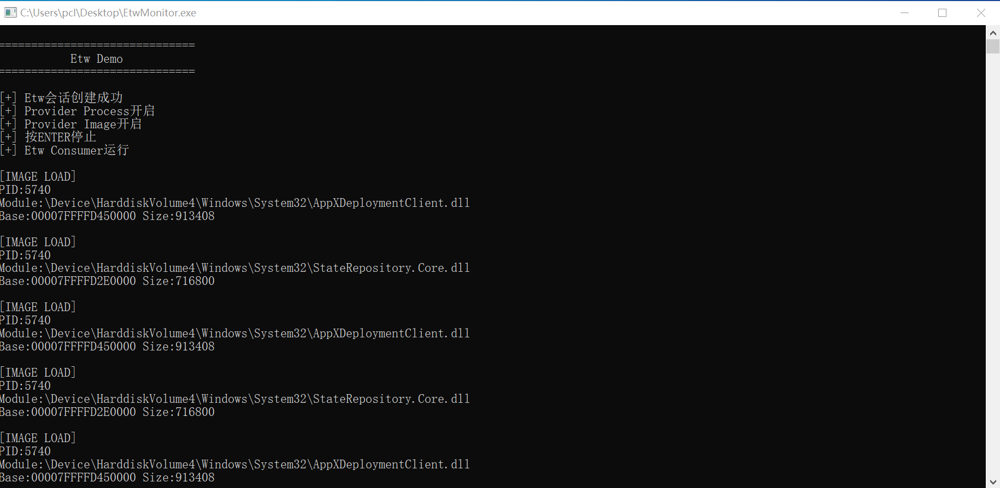
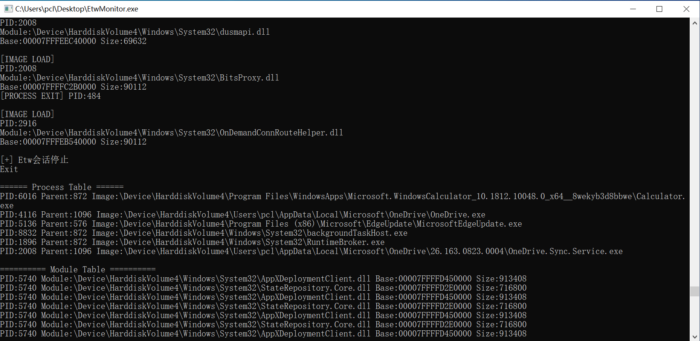

# ETW Process & Image Monitor

基于 Windows ETW（Event Tracing for Windows）的进程与模块行为监控系统。

本项目通过 Windows Kernel Trace Provider 实时采集系统事件，在用户态实现ETW Consumer，对进程创建、进程退出以及模块加载行为进行解析，并维护进程与模块上下文关系。

运行结果：





## 项目介绍

ETW 是 Windows提供的高性能系统事件追踪框架，被广泛应用于系统诊断、安全产品和 EDR平台。

本项目实现了一个轻量级 Telemetry 数据采集模块：

- 捕获 Kernel Process 事件
- 捕获 Image Load 事件
- 使用 TDH 动态解析事件字段
- 建立 Process Context 和 Module Context
- 为后续 EDR 行为分析提供数据基础

## 项目架构

```
                  wmain (main.cpp)
                       │
      ┌────────────────┼────────────────┐
      │                │                │
InitProcessContext  StartEtwSession  InitModuleContext
      │                │                │
ProcessContext   EtwController     ModuleContext
      │                │
      │        CreateThread(EtwConsumerThread)
      │                │
      │       ┌────────▼─────────┐
      │       │ EtwConsumerThread │  OpenTrace / ProcessTrace（阻塞）
      │       └────────┬──────────┘
      │                │  每个事件
      │       ┌────────▼──────────┐
      │       │ EventRecordCallback│  SEH 包裹
      │       └────────┬──────────┘
      │                │
      │       ┌────────▼──────────┐
      │       │   ParseEtwEvent    │  按 ProviderId + EventId 分发
      │       └──┬──────────────┬──┘
      │          │              │
      │   Process Events   Image Events
      │   (Id=1/2)         (Id=5)
      │          │              │
      └──────────┴──────────────┘
                 │
        主线程 getchar → StopEtwSession
                 │
        WaitForSingleObject(hThread, INFINITE)
                 │
        DumpProcessTable / DumpModuleTable
```

---

## 项目结构


```
.
├── Common.h              # 全局定义、GUID 声明、结构体
├── Common.cpp            # GUID 定义、PrintGUID 实现
├── EtwController.h/.cpp  # ETW 会话创建、Provider 启用、停止
├── EtwConsumer.h/.cpp    # 实时消费者线程、事件回调
├── Parser.h/.cpp         # 事件解析与分发（TDH）
├── ProcessContext.h/.cpp # 进程表（PID → 进程信息）
├── ModuleContext.h/.cpp  # 模块表（PID → 模块列表）
└── main.cpp              # 程序入口
```

## 核心功能

### 进程生命周期监控

支持：

- Process Create
- Process Exit

采集：

  字段         说明

------

  PID          进程ID
  Parent PID   父进程ID
  Image Path   进程路径
  Exit Code    退出状态

------

### 模块加载监控

监控：

- EXE加载
- DLL加载

采集：

  字段          说明

------

  Process ID    所属进程
  Module Path   模块路径
  Image Base    加载地址
  Image Size    模块大小

------

# 

## 技术实现

### ETW Session

使用：

```
StartTrace()
EnableTraceEx2()
ControlTrace()
```

完成：

- 创建Trace Session
- 开启Kernel Provider
- 停止Session

### ETW Consumer

使用：

```
OpenTrace()

ProcessTrace()

EventRecordCallback()
```

接收事件。

事件统一进入：

```
ParseEtwEvent()
```

完成：

- Provider判断
- Event ID判断
- Opcode判断
- 数据解析

### TDH动态解析

项目使用Windows官方TDH接口：

```
TdhGetEventInformation()

TdhGetPropertySize()

TdhGetProperty()
```

动态获取：

- Property Name
- Property Type
- Property Value

避免依赖固定偏移，提高Windows版本兼容性。


## 已知限制

- 静态数组容量：MAX_PROCESS_COUNT = 4096、MAX_MODULE_COUNT = 8192，长时间运行可能被填满

- 回调中同步解析：当前在回调内直接解析并打印，高负载下可能丢事件或阻塞

- TDH 字段名与 Windows 版本耦合：不同 Windows 版本上字段名可能不同，需用 DumpEventPayload 实测

- 未处理 PID 复用：长时间运行后 PID 可能被复用，建议引入 ProcessKey = PID + CreateTime

- 无持久化	事件仅保存在内存中，进程退出后丢失

   ​

 

## 后续规划

-  扩展 ETW 数据源：文件（Kernel-File）、网络（Kernel-Network）、注册表（Kernel-Registry）
- 引入 ProcessKey（PID + CreateTime）避免 PID 复用误关联
- 构建进程行为图，实现基础行为关联（如"写入 exe → 创建进程 → 外连"）
- 集成内核回调（PsSetCreateProcessNotifyRoutineEx）做交叉验证
- 规则引擎与告警输出


## Disclaimer

本项目仅用于学习与研究目的。启用内核 ETW Provider 需要管理员权限，请在您拥有合法授权的环境中运行。作者不对任何因使用本项目导致的系统异常、数据丢失或安全事件负责。


